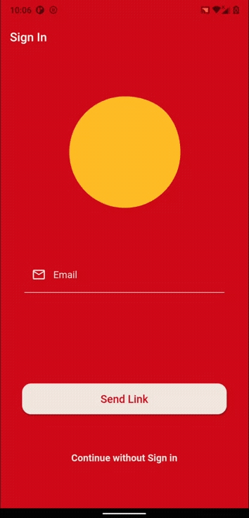
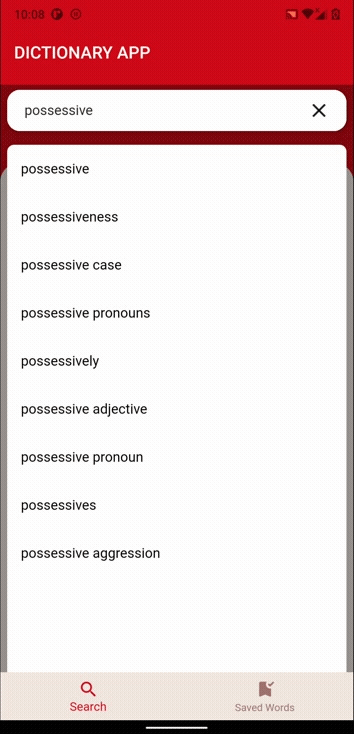
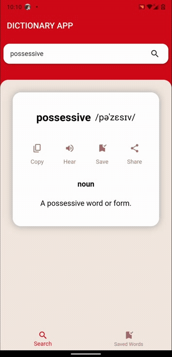
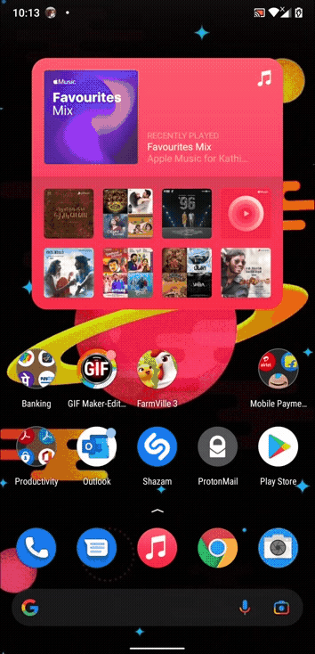
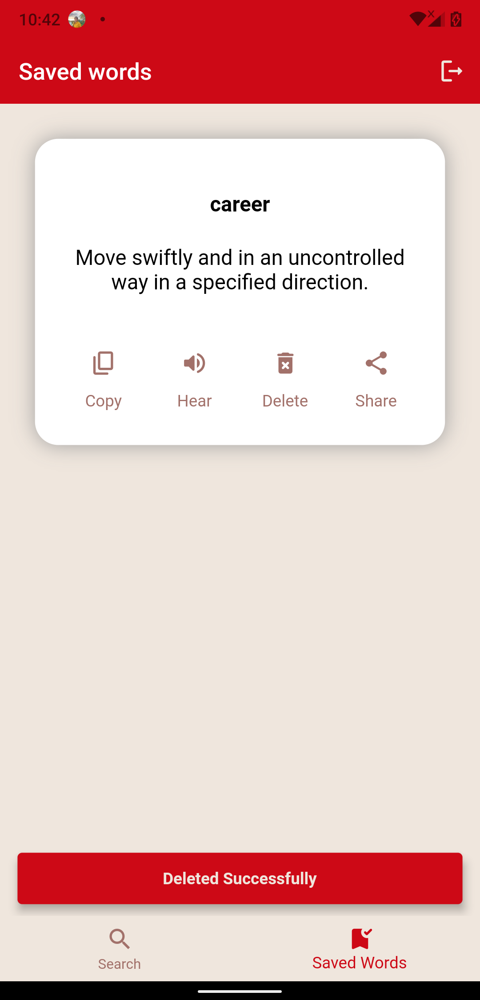

# Dictionary Flutter Application!

Dictionary Flutter Application is made with Flutter and Supabase which allows user to search words and fetch the meaning. End users can save use the app as guest for every single session or they can authenticate with the app and can save the words for later use. Dictionary Flutter Application has E-Mail link authentication which allows unauthorized authentication. 

# Blog link

- [Winner announcement by Supabase](https://supabase.io/blog/2021/08/09/hackathon-winners)

# Usage of Supabase in this app

Supabase is integrated for the purpose of authentication and database.

# Used API's

Dictionary Flutter Application use **Open Source API's** to meet the purpose of the app.

 - [Dictionary API](https://dictionaryapi.dev/)
 - [Datamuse API](https://www.datamuse.com/api/)

# Demo

           
